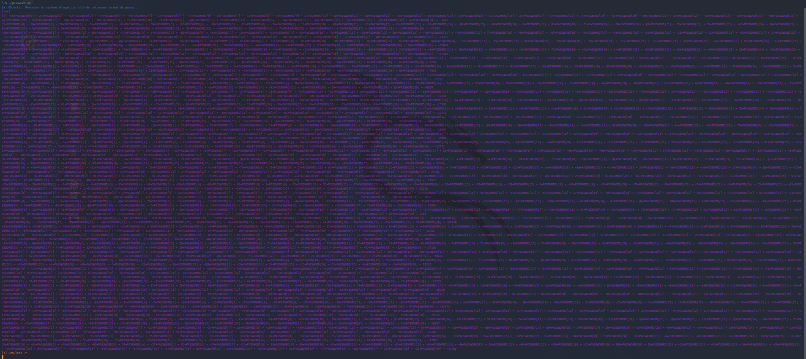
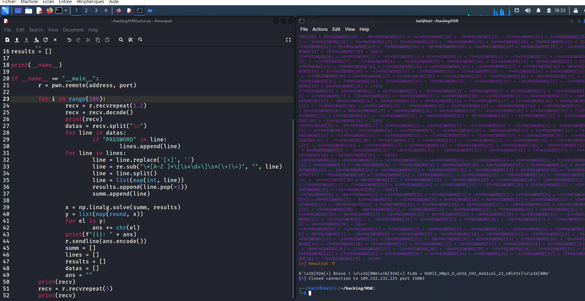

# Mathematician - 75 points

## Statement

> Are you good at solving equations ?
>
> nc 10.22.6.101 15003
>
> infos: type(PASSWORD) --> string PASSWORD[0] = ord(first letter of password)


## Solving

First, I tried the netcat command to see the message format.



You can see the message:
> Objective: Solve the system of equations to find the password

The first thing I tried was to script the resolution of the system of equations by passing the string manually. As the received data is encoded and in a single block, it must be parsed.

By searching, we find that numpy can solve a system of equations with `numpy.linalg.solve` by passing a list with each value of the equation, then a list of the results of each equation.

So first, extract all lines containing "PASSWORD[X]"

```PY
recv = r.recvrepeat(1.5)
recv = recv.decode()
datas = recv.split("\n")
for data in datas:
	if "PASSWORD" in line:
		lines.append(data)
```

At this point, we have a good format where we have one equation per list element.

Now, everything that is not used in the calculation must be removed.

```PY
for line in lines:
	# [+] is only for the first line
	line = line.replace('[+]', '')
	
	# Regex to remove all the PASSWORD[x] and the + signs or = 
	line = re.sub("\*[A-Z ]*\[\s*\d+\]\s*(\+|\=)", "", line)
	
	# then we split the line to have all the numbers
	line = line.split()
	line = list(map(int, line))
	
	# we pop the last number for each line which is the equation result into a new list
	results.append(line.pop(-1))
	
	# all the other numbers goes to other list
	summ.append(line)
```

`results` is the list of all the 40 equation results and `summ` is a two-dimensional array which have all the signed numbers for each lines.

Then we solve the system with numpy. The result is a numpy.float list so we need to convert it to ints.

```PY
x = numpy.linalg.solve(summ, results)
y = list(map(int, x))
```

At this point, if you test the code you'll see that the int cast broke the results. You nee to use round to have the correct numbers

```PY
x = numpy.linalg.solve(summ, results)
y = list(map(round, x))
```

Thanks to the statement, we know that PASSWORD[0] = ord(PASSWORD[0]).

```PY
for el in y:
	ans += chr(el)
	
# send the encoded answer
r.sendline(ans.encode())
```

After solving one system, we can see that they are 99 other systems to solve. So we have to script the receiving and the sending.

Before I knew there were 100 equations to solve, I tried to use the linux pipes to send the stdin to python. In Python, you can retrieve the stdin input with `import fileinput`.

But since we have to solve 100 equations, I turned to sockets.

```PY
import socket 

host = "109.232.232.225"
port = 15003

def netcat(host, port, content=""):
	s = socket.socket(socket.AF_INET, socket.SOCK_STREAM)
	s.connect((host, port))
	while True:
		data = s.recv(1048)
		if not data:
			break
		datas.append(data)
		if b"Resultat" in data;
			break
			
if __name__ == "__main__":
	netcat(host, port)
```

With this method, we can correctly read and parse the data, but we can't send the response, especially 100 times in a row.

So I used `pwntools`, suggested by Aurélien Duboc.

```PY
import pwn

address = "109.232.232.225"
port = 15003

r = pwn.remote(address, port)
# 1 second is to fast, 1.2 second is fine but I prefered round it to 1.5
recv = r.recvrepeat(1.5)
recv = recv.decode()

# [...]

# Send response
r.sendline(ans.encode())
```

Do a for loop (100 times), reset the lists (summ, results, lines, ans) at each iteration and solve the 100 equations. 

```PY
import numpy as np
import re
import pwn

address = "109.232.232.225"
port = 15003
ans = ''

lines = []
summ = []
results = []

if __name__ == "__main__":
	r = pwn.remote(address, port)
	
	for i in range(100):
		recv = r.recvrepeat(1.2)
		recv = recv.decode()
		print(recv)
		datas = recv.split("\n")
		for line in datas:
			if "PASSWORD" in line:
				lines.append(line)
		for line in lines:
			line = line.replace('[+]', '')
			line = re.sub("\*[A-Z ]*\[\s*\d+\]\s*(\+|\=)", "", line)
			line = line.split()
			line = list(map(int, line))
			results.append(line.pop(-1))
			summ.append(line)
		
		x = np.linalg.solve(summ, results)
		y = list(map(round, x))
		for el in y:
			ans += chr(el)
		print(f"{i}: " + ans)
		r.sendline(ans.encode())
		summ = []
		lines = []
		results = []
		datas = []
		ans = ""
	print(recv)
	recv = r.recvrepeat(5)
	print(recv)
```

The lasts `print(recv)` and `recv = r.recvrepeat(5)` are here to be sure to read the flag.



The flag is 
`FLAG = HSR{I_H0p3_U_uS3d_tH3_m4G1cal_z3_s0lV3r}`