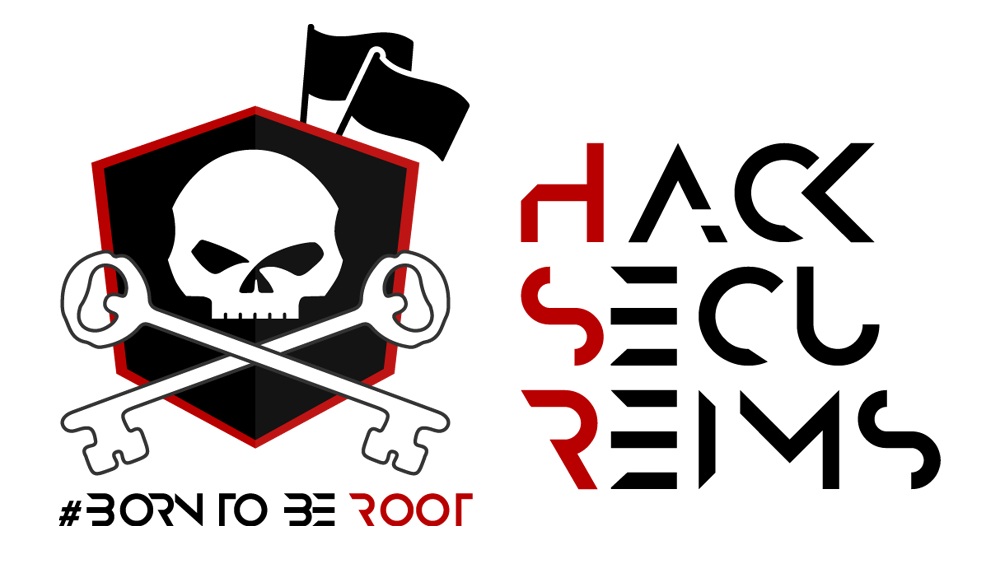

# HackSecuReims2022

Ce dépôt git met à disposition les différents writeups officiels et ceux produits par les différents joueurs du HackSecuReims 2022.

# Challenges

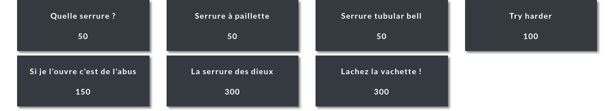

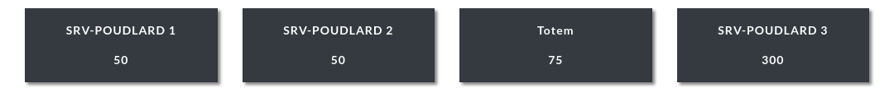

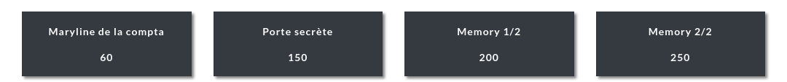

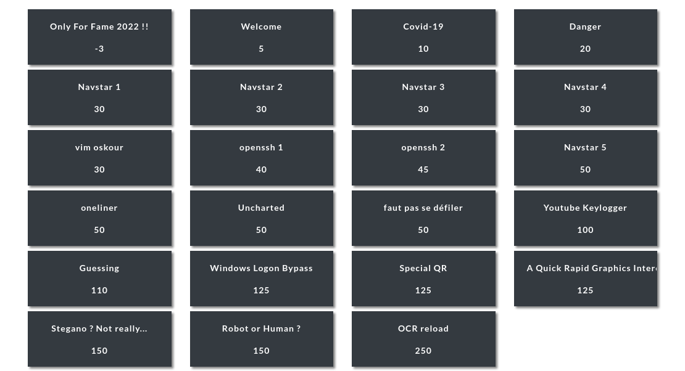

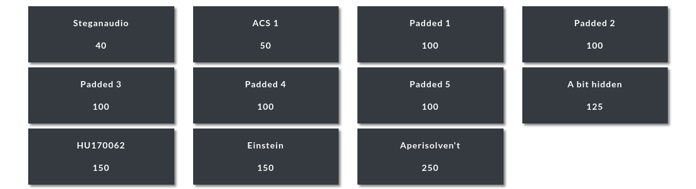

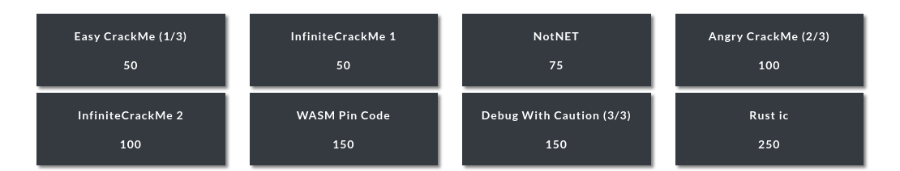

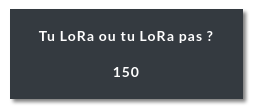

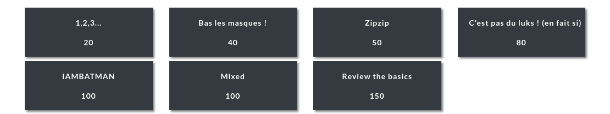

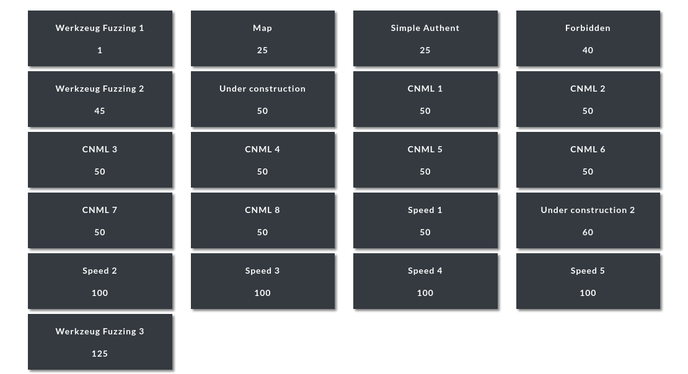

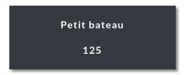

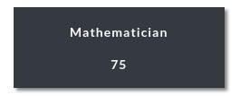

[Mathematician](./Programming/Mathematician/README.md).

# Scoreboard

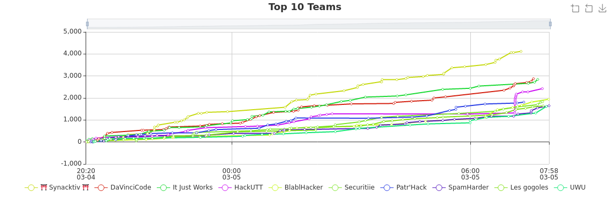

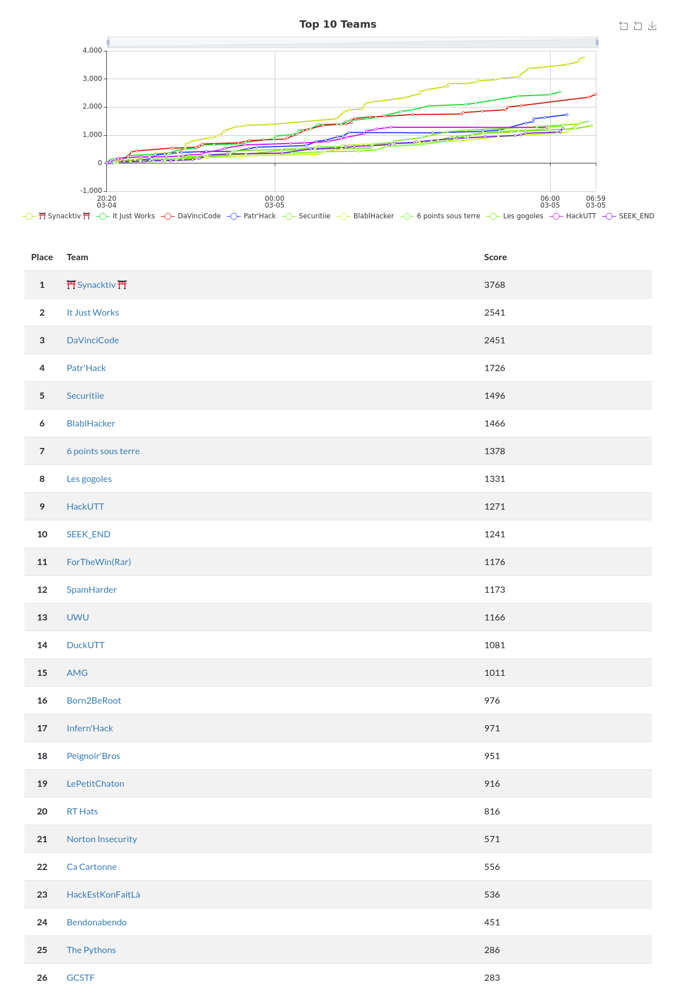
